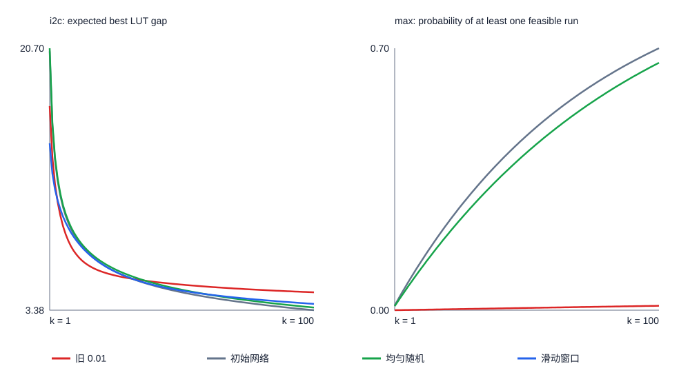

# 四步环境：精确复评与跨回合回报实验

基于完整的 7⁴ 条动作序列计算冻结策略的期望结果；训练期累计最好值另作辅助指标。
最优 LUT 为 int2float=44、i2c=312、max=781。

## 原有模型的精确复评

| 电路 | 旧 0.01 | 初始网络 | 均匀随机 |
|---|---:|---:|---:|
| int2float (单次期望差距) | 3.953 | 4.217 | 4.228 |
| i2c (单次期望差距) | 16.873 | 20.496 | 20.696 |
| max (单次可行率) | 0.000124 | 0.012845 | 0.010829 |

均匀随机在精确口径下每个电路只有一个理论值；它没有训练种子波动。

### 旧模型训练快照

| 电路 | 学习率 | 0 | 50 | 100 | 150 | 200 | 250 |
|---|---|---:|---:|---:|---:|---:|---:|
| int2float | lr001 | 4.217 | 4.192 | 4.170 | 4.144 | 4.126 | 4.113 |
| int2float | lr010 | 4.217 | 4.170 | 4.133 | 3.980 | 3.996 | 3.953 |
| i2c | lr001 | 20.496 | 20.223 | 19.894 | 19.557 | 19.165 | 18.755 |
| i2c | lr010 | 20.496 | 19.094 | 17.242 | 17.196 | 17.328 | 16.873 |
| max | lr001 | 0.012845 | 0.013834 | 0.014199 | 0.014761 | 0.014725 | 0.013434 |
| max | lr010 | 0.012845 | 0.007368 | 0.001179 | 0.000216 | 0.000145 | 0.000124 |

i2c 旧 0.01 相对初始网络的配对平均改善为 3.623 LUT；bootstrap 95% 区间 [-2.086, 7.870]，仍应作为探索性观察。

i2c 旧 0.01 的种子 7、9 逐快照单次期望差距：

| 种子 | 0 | 50 | 100 | 150 | 200 | 250 |
|---:|---:|---:|---:|---:|---:|---:|
| 7 | 19.775 | 17.262 | 15.358 | 24.749 | 33.841 | 37.610 |
| 9 | 20.215 | 28.344 | 21.499 | 23.374 | 22.114 | 22.013 |

## 滑动窗口回报：冻结策略结果

新方法先在 i2c 运行十个配对训练种子。扩展门槛只决定是否运行另外两个电路，不是统计显著性检验。

### i2c

新方法 单次期望差距均值 14.418；旧 0.01 为 16.873。

训练期间累计最好值（辅助）：新方法可行种子 10/10，旧 0.01 为 10/10；全部可行时平均 LUT 分别为 313.400、312.600。

主比较（旧 0.01 减新方法）：平均 2.455 LUT；5/10 个种子改善；bootstrap 95% 区间 [-1.408, 8.058]；配对 t 区间 [-3.513, 8.422]。

扩展门槛：未通过。

新方法均值 14.418；初始网络 20.496；均匀随机 20.696。这些是独立比较，不与主比较混作一个结论。

区间未一致支持改善，方向性结论为不确定。

| 种子 | 旧 0.01 差距 | 新方法差距 | 初始差距 | 旧减新 | 新方法贪心序列 | 贪心差距 |
|---:|---:|---:|---:|---:|---|---:|
| 0 | 12.031 | 17.644 | 19.577 | -5.612 | [0, 6, 4, 4] | 19.000 |
| 1 | 11.627 | 12.190 | 22.822 | -0.563 | [1, 1, 1, 1] | 13.000 |
| 2 | 15.796 | 13.020 | 20.365 | 2.776 | [1, 1, 1, 1] | 13.000 |
| 3 | 11.265 | 13.235 | 20.567 | -1.970 | [1, 1, 1, 1] | 13.000 |
| 4 | 11.774 | 12.535 | 20.656 | -0.761 | [1, 1, 1, 1] | 13.000 |
| 5 | 11.233 | 12.312 | 20.161 | -1.079 | [1, 1, 1, 1] | 13.000 |
| 6 | 19.719 | 19.711 | 20.313 | 0.008 | [0, 6, 0, 0] | 26.000 |
| 7 | 37.610 | 12.782 | 19.775 | 24.828 | [1, 1, 1, 1] | 13.000 |
| 8 | 15.660 | 12.920 | 20.507 | 2.740 | [1, 1, 1, 1] | 13.000 |
| 9 | 22.013 | 17.831 | 20.215 | 4.182 | [0, 6, 0, 0] | 26.000 |

### 更新幅度诊断

新方法最后 50 轮平均 |优势|=0.434，Actor 更新 RMS=0.000753；旧 0.01 的 Actor 更新 RMS=0.000844。旧实验没有逐轮保存 |优势|，因此不作这一项的直接配对比较。

## 复核与局限

旧评估的 1200 条轨迹已逐动作与最好结果核对。穷举只覆盖固定四步动作空间。精确评估消除了冻结轨迹抽样噪声，没有消除训练种子之间的不确定性。
训练期间见过的最好 LUT 是相同搜索预算下的辅助指标，不能替代冻结策略的单次表现。
优于旧 0.01 不自动等于优于初始网络或均匀随机。
