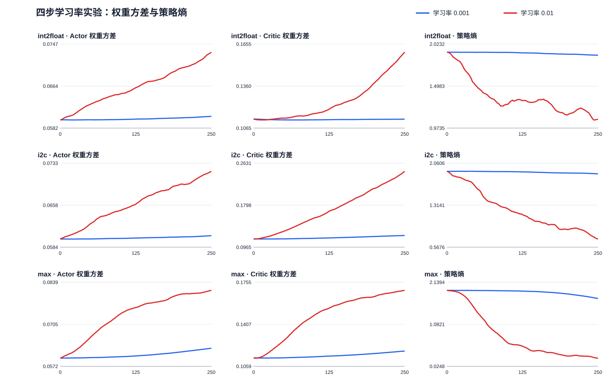

# 四步环境学习率对照与独立策略评估

## 实验条件

int2float、i2c、max；训练种子0–9；每组250轮×4动作；原A2C每轮更新一次。学习率分别为0.001、0.01；均匀随机组没有权重更新。其余网络、奖励、归一化、动作、LUT6和层数限制与原参数一致。四步最优可行LUT依次为44、312、781。

每个最终模型、对应初始权重和独立随机组各在10个新随机种子上执行完整四步序列。同一电路和训练种子内四组共用评估种子；不同训练种子有各自的随机组评估bank。每条轨迹从原电路重新开始，策略冻结，初始映射可成为最佳候选。

## 主要观察

三个电路中，0.01 相对 0.001 的最终 Actor/Critic 权重方差配对均值均上升，固定探针策略熵均下降。这些参数变化本身不能证明策略表现改善。

int2float 的训练搜索平均 LUT 差距在 0.001 和 0.01 下分别为 1.0 与 1.2；独立评估的种子最佳 LUT 平均差距分别为 2.4 与 2.7，两档最终策略都没有命中四步最优。

训练搜索中，i2c 的平均最优 LUT 差距从 1.4 降到 0.6，最优命中从 3/10 变为 6/10；但冻结策略每模型10次评估的种子最佳 LUT 平均差距从 5.8 变为 8.2，两档都没有命中四步最优。训练期搜索收益未在这组独立尝试中得到支持。

max 的训练搜索中，0.001 有 10/10 个可行种子、10/10 个命中最优；0.01 分别为 6/10 和 3/10。冻结评估中两档最终策略分别只有 1/100 和 0/100 次可行，初始权重与随机策略各为 1/100 和 1/100。在这十次尝试的分辨率下，不能把训练时命中最优解释为冻结策略已稳定掌握可行序列。

## 训练期间搜索（250轮，含每轮初始映射）

| 电路 | 组别 | 可行种子/10 | 命中四步最优/10 | 平均LUT差距 |
|---|---|---:|---:|---:|
| int2float | lr001 | 10/10 | 2/10 | 1.000 |
| int2float | lr010 | 10/10 | 1/10 | 1.200 |
| int2float | uniform | 10/10 | 2/10 | 1.000 |
| i2c | lr001 | 10/10 | 3/10 | 1.400 |
| i2c | lr010 | 10/10 | 6/10 | 0.600 |
| i2c | uniform | 10/10 | 3/10 | 2.100 |
| max | lr001 | 10/10 | 10/10 | 0.000 |
| max | lr010 | 6/10 | 3/10 | 未定义 |
| max | uniform | 10/10 | 10/10 | 0.000 |

| 电路 | A2C学习率 | 相对随机组符合预定标准 | 不更差的种子/10 |
|---|---:|---|---:|
| int2float | lr001 | 否 | 8 |
| int2float | lr010 | 否 | 7 |
| i2c | lr001 | 是 | 10 |
| i2c | lr010 | 是 | 10 |
| max | lr001 | 否 | 10 |
| max | lr010 | 无法判定（有种子未找到可行解） | 未定义 |

这里的累计最好值衡量相同搜索预算下找到的解；不单独证明冻结后的策略有所改善。

## 训练后独立策略评估（每模型10次）

| 电路 | 策略 | 可行尝试/100 | 最优命中/100 | 有可行解种子/10 | 种子最佳LUT平均差距 |
|---|---|---:|---:|---:|---:|
| int2float | lr001-final | 100/100 | 0/100 | 10/10 | 2.400 |
| int2float | lr010-final | 100/100 | 0/100 | 10/10 | 2.700 |
| int2float | initial | 100/100 | 0/100 | 10/10 | 2.400 |
| int2float | uniform | 100/100 | 0/100 | 10/10 | 2.400 |
| i2c | lr001-final | 100/100 | 0/100 | 10/10 | 5.800 |
| i2c | lr010-final | 100/100 | 0/100 | 10/10 | 8.200 |
| i2c | initial | 100/100 | 0/100 | 10/10 | 8.000 |
| i2c | uniform | 100/100 | 0/100 | 10/10 | 7.300 |
| max | lr001-final | 1/100 | 1/100 | 1/10 | 未定义 |
| max | lr010-final | 0/100 | 0/100 | 0/10 | 未定义 |
| max | initial | 1/100 | 1/100 | 1/10 | 未定义 |
| max | uniform | 1/100 | 1/100 | 1/10 | 未定义 |

十次尝试中若没有可行解，该种子的最佳LUT差距未定义；汇总均值仅在全部十个种子都有可行解时给出。尤其是max，十次四步评估对可行率和最优命中的分辨力很低。

### 逐种子独立评估

| 电路 | seed | 0.001最终 可行/命中/最佳LUT | 0.01最终 可行/命中/最佳LUT | 初始权重 可行/命中/最佳LUT | 均匀随机 可行/命中/最佳LUT |
|---|---:|---|---|---|---|
| int2float | 0 | 10/10 / 0/10 / 47 | 10/10 / 0/10 / 48 | 10/10 / 0/10 / 46 | 10/10 / 0/10 / 46 |
| int2float | 1 | 10/10 / 0/10 / 47 | 10/10 / 0/10 / 47 | 10/10 / 0/10 / 48 | 10/10 / 0/10 / 47 |
| int2float | 2 | 10/10 / 0/10 / 47 | 10/10 / 0/10 / 46 | 10/10 / 0/10 / 47 | 10/10 / 0/10 / 48 |
| int2float | 3 | 10/10 / 0/10 / 47 | 10/10 / 0/10 / 47 | 10/10 / 0/10 / 47 | 10/10 / 0/10 / 47 |
| int2float | 4 | 10/10 / 0/10 / 45 | 10/10 / 0/10 / 48 | 10/10 / 0/10 / 45 | 10/10 / 0/10 / 45 |
| int2float | 5 | 10/10 / 0/10 / 46 | 10/10 / 0/10 / 46 | 10/10 / 0/10 / 46 | 10/10 / 0/10 / 46 |
| int2float | 6 | 10/10 / 0/10 / 47 | 10/10 / 0/10 / 47 | 10/10 / 0/10 / 47 | 10/10 / 0/10 / 47 |
| int2float | 7 | 10/10 / 0/10 / 45 | 10/10 / 0/10 / 46 | 10/10 / 0/10 / 45 | 10/10 / 0/10 / 45 |
| int2float | 8 | 10/10 / 0/10 / 47 | 10/10 / 0/10 / 46 | 10/10 / 0/10 / 47 | 10/10 / 0/10 / 47 |
| int2float | 9 | 10/10 / 0/10 / 46 | 10/10 / 0/10 / 46 | 10/10 / 0/10 / 46 | 10/10 / 0/10 / 46 |
| i2c | 0 | 10/10 / 0/10 / 315 | 10/10 / 0/10 / 313 | 10/10 / 0/10 / 315 | 10/10 / 0/10 / 317 |
| i2c | 1 | 10/10 / 0/10 / 318 | 10/10 / 0/10 / 313 | 10/10 / 0/10 / 329 | 10/10 / 0/10 / 318 |
| i2c | 2 | 10/10 / 0/10 / 319 | 10/10 / 0/10 / 325 | 10/10 / 0/10 / 323 | 10/10 / 0/10 / 323 |
| i2c | 3 | 10/10 / 0/10 / 320 | 10/10 / 0/10 / 313 | 10/10 / 0/10 / 320 | 10/10 / 0/10 / 321 |
| i2c | 4 | 10/10 / 0/10 / 315 | 10/10 / 0/10 / 313 | 10/10 / 0/10 / 315 | 10/10 / 0/10 / 317 |
| i2c | 5 | 10/10 / 0/10 / 315 | 10/10 / 0/10 / 313 | 10/10 / 0/10 / 318 | 10/10 / 0/10 / 318 |
| i2c | 6 | 10/10 / 0/10 / 318 | 10/10 / 0/10 / 322 | 10/10 / 0/10 / 322 | 10/10 / 0/10 / 318 |
| i2c | 7 | 10/10 / 0/10 / 324 | 10/10 / 0/10 / 352 | 10/10 / 0/10 / 324 | 10/10 / 0/10 / 327 |
| i2c | 8 | 10/10 / 0/10 / 316 | 10/10 / 0/10 / 316 | 10/10 / 0/10 / 316 | 10/10 / 0/10 / 316 |
| i2c | 9 | 10/10 / 0/10 / 318 | 10/10 / 0/10 / 322 | 10/10 / 0/10 / 318 | 10/10 / 0/10 / 318 |
| max | 0 | 0/10 / 0/10 / 无可行解 | 0/10 / 0/10 / 无可行解 | 0/10 / 0/10 / 无可行解 | 0/10 / 0/10 / 无可行解 |
| max | 1 | 1/10 / 1/10 / 781 | 0/10 / 0/10 / 无可行解 | 0/10 / 0/10 / 无可行解 | 0/10 / 0/10 / 无可行解 |
| max | 2 | 0/10 / 0/10 / 无可行解 | 0/10 / 0/10 / 无可行解 | 0/10 / 0/10 / 无可行解 | 0/10 / 0/10 / 无可行解 |
| max | 3 | 0/10 / 0/10 / 无可行解 | 0/10 / 0/10 / 无可行解 | 0/10 / 0/10 / 无可行解 | 0/10 / 0/10 / 无可行解 |
| max | 4 | 0/10 / 0/10 / 无可行解 | 0/10 / 0/10 / 无可行解 | 0/10 / 0/10 / 无可行解 | 0/10 / 0/10 / 无可行解 |
| max | 5 | 0/10 / 0/10 / 无可行解 | 0/10 / 0/10 / 无可行解 | 0/10 / 0/10 / 无可行解 | 0/10 / 0/10 / 无可行解 |
| max | 6 | 0/10 / 0/10 / 无可行解 | 0/10 / 0/10 / 无可行解 | 0/10 / 0/10 / 无可行解 | 0/10 / 0/10 / 无可行解 |
| max | 7 | 0/10 / 0/10 / 无可行解 | 0/10 / 0/10 / 无可行解 | 1/10 / 1/10 / 781 | 1/10 / 1/10 / 781 |
| max | 8 | 0/10 / 0/10 / 无可行解 | 0/10 / 0/10 / 无可行解 | 0/10 / 0/10 / 无可行解 | 0/10 / 0/10 / 无可行解 |
| max | 9 | 0/10 / 0/10 / 无可行解 | 0/10 / 0/10 / 无可行解 | 0/10 / 0/10 / 无可行解 | 0/10 / 0/10 / 无可行解 |

## 权重方差和策略熵

权重方差为各Linear权重矩阵元素的总体方差，Actor和Critic分开计算；不含偏置。熵为同一电路固定状态探针上七动作分布的平均熵，均匀策略的理论值为ln(7)≈1.946。下表区间是按十个配对训练种子重采样的探索性95%区间。

| 电路 | 指标 | 初始均值 | 0.001最终 | 0.01最终 | 0.01−0.001配对差 | 探索性95%区间 |
|---|---|---:|---:|---:|---:|---|
| int2float | Actor 权重方差 | 0.059815 | 0.060495 | 0.073068 | 0.012573 | [0.009606, 0.016240] |
| int2float | Critic 权重方差 | 0.112844 | 0.112774 | 0.159795 | 0.047021 | [0.014403, 0.099423] |
| int2float | 策略熵 | 1.920908 | 1.883660 | 1.082739 | -0.800922 | [-1.127124, -0.501753] |
| i2c | Actor 权重方差 | 0.059815 | 0.060420 | 0.071876 | 0.011456 | [0.008585, 0.015050] |
| i2c | Critic 权重方差 | 0.112844 | 0.119721 | 0.247011 | 0.127290 | [0.089502, 0.169140] |
| i2c | 策略熵 | 1.913721 | 1.871165 | 0.712071 | -1.159093 | [-1.449158, -0.839339] |
| max | Actor 权重方差 | 0.059815 | 0.062954 | 0.081279 | 0.018325 | [0.015070, 0.022020] |
| max | Critic 权重方差 | 0.112844 | 0.118495 | 0.168800 | 0.050306 | [0.044106, 0.056542] |
| max | 策略熵 | 1.934759 | 1.730052 | 0.230965 | -1.499087 | [-1.611686, -1.378884] |

参数方差、漂移和熵的变化描述训练动态，不能单独判定策略质量。两档学习率的每轮明细见diagnostics.csv，逐种子配对差见diagnostic-pairs.csv。

## 十次独立尝试的不确定性

每个固定模型的可行率和最优命中率按10次尝试计算双侧 Wilson 95% 区间；全部逐种子区间见 [evaluation-intervals.csv](evaluation-intervals.csv)。即使观察到 0/10，区间仍为 [0.000, 0.278]；观察到 10/10 时为 [0.722, 1.000]。这些区间只描述固定模型下重复抽取四步动作的精度，不包含训练种子之间的变动。

四步穷举数据中，max 的 2401 条均匀动作序列仅有 26 条可行；抽取10条时至少一次可行的概率约为 10.3%。因此 0/10 可行仍是常见的随机波动。

下表按同一训练种子配对，展示每种策略相对对照组的可行率差；区间从10个训练种子重采样10,000次得到。逐组最优命中率差及区间另见 [evaluation-pairs.csv](evaluation-pairs.csv)。区间属于探索性估计，不能据此宣称普遍收益。

| 电路 | 策略 − 对照 | 平均可行率差 | 探索性95%区间 |
|---|---|---:|---|
| int2float | lr001-final − initial | +0.000 | [+0.000, +0.000] |
| int2float | lr001-final − uniform | +0.000 | [+0.000, +0.000] |
| int2float | lr010-final − initial | +0.000 | [+0.000, +0.000] |
| int2float | lr010-final − uniform | +0.000 | [+0.000, +0.000] |
| int2float | lr010-final − lr001-final | +0.000 | [+0.000, +0.000] |
| i2c | lr001-final − initial | +0.000 | [+0.000, +0.000] |
| i2c | lr001-final − uniform | +0.000 | [+0.000, +0.000] |
| i2c | lr010-final − initial | +0.000 | [+0.000, +0.000] |
| i2c | lr010-final − uniform | +0.000 | [+0.000, +0.000] |
| i2c | lr010-final − lr001-final | +0.000 | [+0.000, +0.000] |
| max | lr001-final − initial | +0.000 | [-0.030, +0.030] |
| max | lr001-final − uniform | +0.000 | [-0.030, +0.030] |
| max | lr010-final − initial | -0.010 | [-0.030, +0.000] |
| max | lr010-final − uniform | -0.010 | [-0.030, +0.000] |
| max | lr010-final − lr001-final | -0.010 | [-0.030, +0.000] |

## 复核与局限

训练、评估和工具指纹见results/four-step-lr/中的experiment.json及evaluation.json；逐条评估见evaluation.csv。每次独立评估的模型与检查点在评估前后均核对哈希；最佳映射网表通过ABC组合等价性检查。测试与完整性复核结果见validation.json。

每模型仅10条独立轨迹，因此独立评估属于小样本观察；不从不可行轨迹筛选LUT后声称平均收益。当前结论仅覆盖这三个电路、固定四步环境及本次训练预算。

本实验使用AI辅助编写实验代码、检查统计口径和起草报告；全部数字由保存的运行记录生成。
