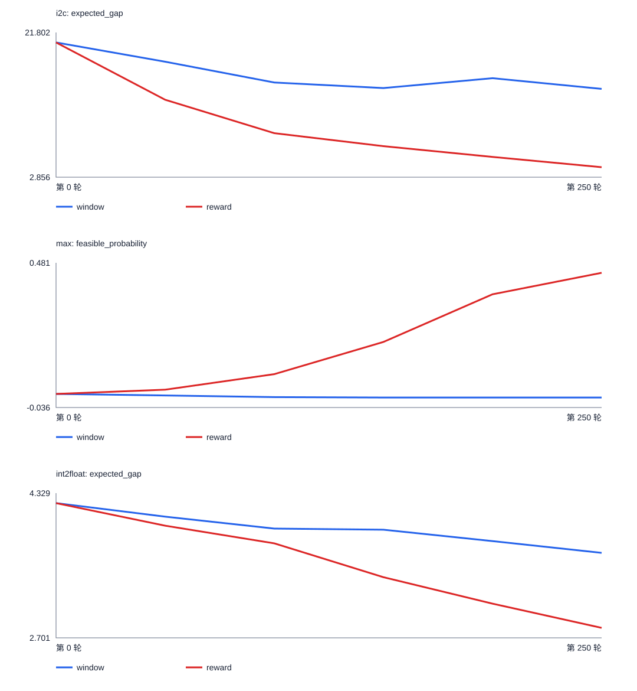
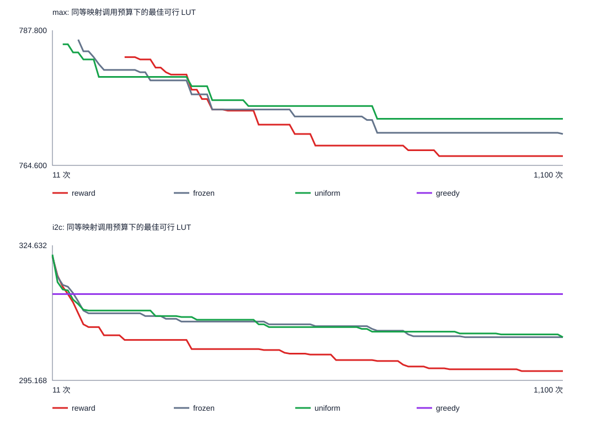

# 四步奖励实验与条件性十步验证

## 实验条件与前置核验

在固定四步动作空间中仅更换奖励；滑动窗口长度 8、学习率 0.01、训练种子 0–9、每种子 250×4 与原窗口实验一致。i2c、max 分别设主比较，int2float 为次要观察。四步穷举最优 LUT：int2float 44、i2c 312、max 781。

- 查表环境：10/10 个 i2c 最终网络哈希一致。
- 20 轮预检：i2c 窗口阶段 mean|A|=1.119；参考值 0.434；状态 pass。
- 候选奖励审计：pass；γ=0.99 下三电路最高分序列全部最优。
- 最佳网表：100/100 份均经 ABC 组合等价检查与 LUT/层数复核，哈希见 evidence.json；其中复用历史网表 22 份。

| 电路 | 原奖励并列最高 | 其中最优 | 新奖励并列最高 | 其中最优 | 新奖励第一、二档分差 |
|---|---:|---:|---:|---:|---:|
| int2float | 12 | 2 | 2 | 2 | 1.960200 |
| i2c | 500 | 4 | 2 | 2 | 0.065015 |
| max | 1 | 0 | 7 | 7 | 0.985765 |

## 四步精确复评

每个冻结模型遍历全部 2,401 条四步动作序列；随机基线是理论概率，训练种子而非动作路径是配对比较的独立单位。正的“改善”表示新奖励更好。

| 电路及主指标 | 窗口版均值 | 新奖励均值 | 平均配对改善 | 改善种子 | 探索性 bootstrap 95% 区间 | 门槛 |
|---|---:|---:|---:|---:|---|---|
| i2c（单次期望差距） | 14.418 | 4.162 | 10.256 | 10/10 | [7.905, 12.844] | 通过 |
| max（单次可行率） | 0.000058 | 0.445250 | 0.445192 | 10/10 | [0.253380, 0.643999] | 通过 |
| int2float（单次期望差距） | 3.658 | 2.814 | 0.844 | 8/10 | [0.360, 1.298] | 次要观察 |

max 的门槛另外要求新奖励平均可行率高于初始网络；以上门槛用于决定十步扩展，不作统计显著性判断。

### 逐种子配对结果

下表 i2c 与 int2float 为单次期望 LUT 差距，越低越好；max 为单次可行率，越高越好。配对改善均以正数为好。

| 电路 | 种子 | 窗口版 | 新奖励 | 配对改善 |
|---|---:|---:|---:|---:|
| i2c | 0 | 17.644 | 1.963 | 15.681 |
| i2c | 1 | 12.190 | 7.017 | 5.173 |
| i2c | 2 | 13.020 | 1.480 | 11.540 |
| i2c | 3 | 13.235 | 4.681 | 8.555 |
| i2c | 4 | 12.535 | 4.831 | 7.705 |
| i2c | 5 | 12.312 | 7.457 | 4.855 |
| i2c | 6 | 19.711 | 1.629 | 18.082 |
| i2c | 7 | 12.782 | 4.070 | 8.712 |
| i2c | 8 | 12.920 | 1.081 | 11.839 |
| i2c | 9 | 17.831 | 7.414 | 10.416 |
| max | 0 | 6.02684e-09 | 0.361185 | 0.361185 |
| max | 1 | 5.75018e-08 | 0.991051 | 0.991051 |
| max | 2 | 0.000516968 | 0.60334 | 0.602824 |
| max | 3 | 1.74574e-06 | 7.73502e-05 | 7.56045e-05 |
| max | 4 | 1.05364e-06 | 0.396923 | 0.396922 |
| max | 5 | 5.39352e-08 | 0.5709 | 0.5709 |
| max | 6 | 6.0561e-10 | 0.468605 | 0.468605 |
| max | 7 | 5.45801e-05 | 0.186368 | 0.186313 |
| max | 8 | 4.3755e-06 | 0.868001 | 0.867997 |
| max | 9 | 1.19609e-08 | 0.00604995 | 0.00604994 |
| int2float | 0 | 3.858 | 3.635 | 0.223 |
| int2float | 1 | 4.063 | 2.892 | 1.171 |
| int2float | 2 | 3.802 | 2.757 | 1.046 |
| int2float | 3 | 4.078 | 2.059 | 2.019 |
| int2float | 4 | 3.757 | 2.178 | 1.579 |
| int2float | 5 | 3.761 | 3.848 | -0.087 |
| int2float | 6 | 3.867 | 2.898 | 0.969 |
| int2float | 7 | 3.809 | 2.315 | 1.494 |
| int2float | 8 | 2.728 | 2.078 | 0.651 |
| int2float | 9 | 2.852 | 3.476 | -0.623 |

最优命中概率与四步贪心动作序列见 paired.csv。

### 理论基线、贪心与训练搜索

| 电路 | 初始网络主指标 | 均匀随机主指标 | 均匀随机最优命中概率 | 新奖励贪心最优种子 | 新奖励训练期最好 LUT 均值 |
|---|---:|---:|---:|---:|---:|
| i2c | 20.496 | 20.696 | 0.001666 | 0/10 | 312.200 |
| max | 0.012845 | 0.010829 | 0.007913 | 3/10 | 未定义 |
| int2float | 4.217 | 4.228 | 0.000833 | 0/10 | 45.000 |

训练期间累计最好值仅是辅助搜索指标。max 两组均仅 8/10 个种子在训练抽样中找到可行网表，因此不报告十种子最好 LUT 均值。

### 第 0/50/100/150/200/250 轮快照

| 电路 | 策略 | 0 | 50 | 100 | 150 | 200 | 250 |
|---|---|---:|---:|---:|---:|---:|---:|
| i2c | window | 20.496 | 17.975 | 15.249 | 14.523 | 15.815 | 14.418 |
| i2c | reward | 20.496 | 12.996 | 8.617 | 6.917 | 5.510 | 4.162 |
| max | window | 0.012845 | 0.007522 | 0.001482 | 0.000082 | 0.000032 | 0.000058 |
| max | reward | 0.012845 | 0.028084 | 0.083514 | 0.198350 | 0.368420 | 0.445250 |
| int2float | window | 4.217 | 4.065 | 3.931 | 3.918 | 3.789 | 3.658 |
| int2float | reward | 4.217 | 3.963 | 3.765 | 3.384 | 3.086 | 2.814 |

## 条件性十步验证

十步使用真实 ABC，每种子 100×10 动作、1,100 次映射；已核验的旧冻结及均匀随机轨迹才复用。以下只陈述观测到的可行性和最佳 LUT，不推断十步全局最优。

历史轨迹的 `drills/model.py` 文件哈希与当前版本不同。复用前已核对协议、工具和电路哈希，逐回合重建轨迹与最佳结果，并在当前 ABC 环境中复演首回合动作及映射；12 条历史轨迹通过这些检查。

| 电路 | 种子 | 新奖励最好 LUT | 冻结最好 LUT | 随机最好 LUT | 贪心最好 LUT | 新奖励胜过两基线 |
|---|---:|---:|---:|---:|---:|---|
| max | 0 | 764 | 763 | 769 | 不可行 | 否 |
| max | 1 | 772 | 775 | 778 | 767 | 是 |
| max | 2 | 760 | 773 | 777 | 779 | 是 |
| max | 3 | 767 | 769 | 769 | 不可行 | 是 |
| max | 4 | 768 | 770 | 770 | 不可行 | 是 |

max 十步 5/5 门槛：4/5，未通过。

| 电路 | 种子 | 新奖励最好 LUT | 冻结最好 LUT | 随机最好 LUT | 贪心最好 LUT | 新奖励胜过两基线 |
|---|---:|---:|---:|---:|---:|---|
| i2c | 0 | 298 | 301 | 304 | 314 | 是 |
| i2c | 1 | 299 | 307 | 304 | 314 | 是 |
| i2c | 2 | 297 | 306 | 305 | 314 | 是 |
| i2c | 3 | 297 | 304 | 304 | 314 | 是 |
| i2c | 4 | 295 | 305 | 306 | 314 | 是 |

i2c 十步 5/5 门槛：5/5，通过。

### 观测到的可行回合率

每个策略的数值是五个种子各 100 回合的可行回合率均值；逐种子值见 ten-results.csv。

| 电路 | 新奖励 | 冻结 | 均匀随机 | 贪心 |
|---|---:|---:|---:|---:|
| max | 39.2% | 20.6% | 20.2% | 40.0% |
| i2c | 100.0% | 100.0% | 100.0% | 100.0% |

逐种子可行回合率和等调用预算曲线见 ten-results.csv、ten-curves.csv。

## 解释与复现边界

四步精确评估消除了冻结策略抽样噪声，仍只有十个独立训练种子；区间和 6/10 门槛不构成显著性声明。max 不可行路径不赋任意 LUT 罚分。查表只用于四步，十步结果来自真实 ABC 调用。原始模型、逐步日志和完整状态位于本机 Git 忽略的 results/four-step-reward/；Git 保存协议、代码、精简表、图及哈希清单。
源代码、工具、电路、穷举表、特征缓存的 SHA-256 见 artifact-manifest.json；逐运行最佳网表、CEC 日志和结果哈希见 evidence.json；完整运行 manifest 保存在本机 results/。
