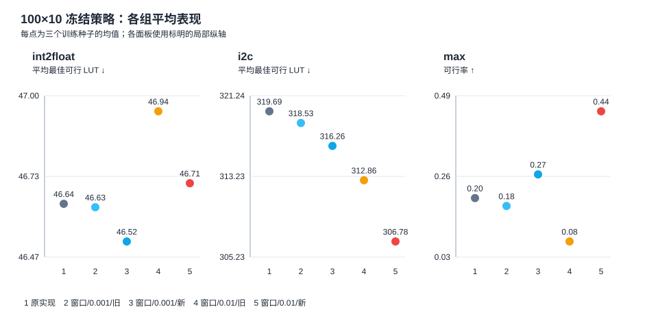
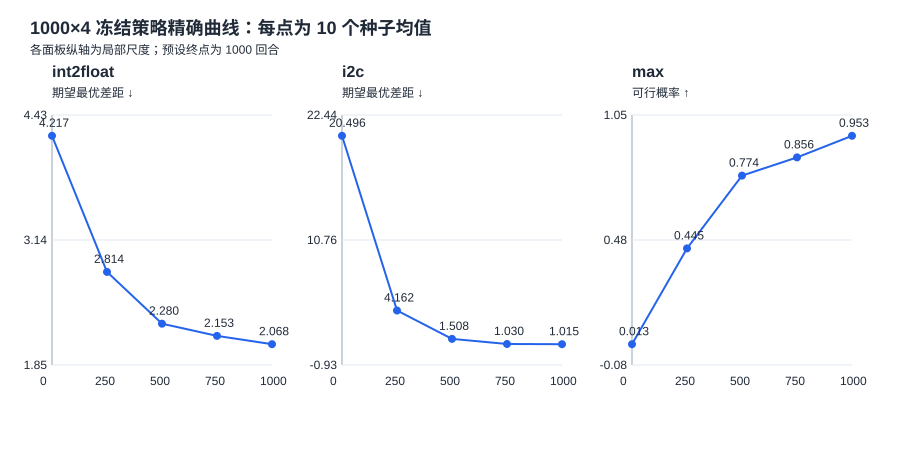

# 学习率、奖励与训练轮数：两步实验报告

## 实验口径

第一步在同样的 100 回合×10 步（每模型 1,100 次 ABC 映射）下比较原始实现与窗口回报的学习率×奖励四格。三个训练种子为原仓库的 0、1、2；每个冻结模型使用 30 条新的十步轨迹，同种子五组共享评估随机数。主指标是冻结策略表现，训练期最好解是次要搜索指标。

第二步固定窗口回报、学习率 0.01 和新奖励，只把四步训练从 250 回合延长到 1000 回合。使用种子 0–9 和已认证查表环境；冻结策略对 2,401 条四步动作序列作精确评估。

这两步都是对已探索过的设置继续研究；第一步只有三个独立训练种子。下文不使用显著性通过或普遍有效的表述。

## 第一步：100×10 的冻结策略

| 电路 | 配置 | seed 0 | seed 1 | seed 2 | 三种子均值 |
|---|---|---:|---:|---:|---:|
| int2float | 原始实现 | 46.867 | 46.600 | 46.467 | 46.644 |
| int2float | 窗口/0.001/旧奖励 | 46.833 | 46.367 | 46.700 | 46.633 |
| int2float | 窗口/0.001/新奖励 | 46.767 | 46.433 | 46.367 | 46.522 |
| int2float | 窗口/0.01/旧奖励 | 47.333 | 46.533 | 46.967 | 46.944 |
| int2float | 窗口/0.01/新奖励 | 47.000 | 46.533 | 46.600 | 46.711 |
| i2c | 原始实现 | 315.533 | 322.233 | 321.300 | 319.689 |
| i2c | 窗口/0.001/旧奖励 | 315.533 | 319.900 | 320.167 | 318.533 |
| i2c | 窗口/0.001/新奖励 | 312.700 | 318.967 | 317.100 | 316.256 |
| i2c | 窗口/0.01/旧奖励 | 310.967 | 314.000 | 313.600 | 312.856 |
| i2c | 窗口/0.01/新奖励 | 305.700 | 308.533 | 306.100 | 306.778 |
| max | 原始实现 | 0.233 | 0.133 | 0.233 | 0.200 |
| max | 窗口/0.001/旧奖励 | 0.300 | 0.100 | 0.133 | 0.178 |
| max | 窗口/0.001/新奖励 | 0.333 | 0.233 | 0.233 | 0.267 |
| max | 窗口/0.01/旧奖励 | 0.200 | 0.033 | 0.000 | 0.078 |
| max | 窗口/0.01/新奖励 | 0.433 | 0.400 | 0.500 | 0.444 |

i2c、int2float 的数值是平均最佳可行 LUT，越低越好；max 是可行轨迹比例，越高越好。各轨迹包含初始映射，不可行 max 轨迹没有被赋予虚构 LUT 罚分。

### 最终组合相对原始实现

| 电路 | seed 0 改善 | seed 1 改善 | seed 2 改善 | 平均改善 | 改善种子 | 观察 |
|---|---:|---:|---:|---:|---:|---|
| int2float | -0.133 | +0.067 | -0.133 | -0.067 | 1/3 | 种子方向不一致 |
| i2c | +9.833 | +13.700 | +15.200 | +12.911 | 3/3 | 三个种子均改善 |
| max | +0.200 | +0.267 | +0.267 | +0.244 | 3/3 | 三个种子均改善 |

正值表示最终组合较好；i2c、int2float 为减少的 LUT，max 为增加的可行率。三种子方向描述不等于统计检验通过。

### 学习率、奖励和窗口对照

| 电路 | 对照 | seed 0 | seed 1 | seed 2 | 均值 |
|---|---|---:|---:|---:|---:|
| int2float | 窗口效应：0.001＋旧奖励 | +0.033 | +0.233 | -0.233 | +0.011 |
| int2float | 学习率：旧奖励 | -0.500 | -0.167 | -0.267 | -0.311 |
| int2float | 学习率：新奖励 | -0.233 | -0.100 | -0.233 | -0.189 |
| int2float | 奖励：0.001 | +0.067 | -0.067 | +0.333 | +0.111 |
| int2float | 奖励：0.01 | +0.333 | +0.000 | +0.367 | +0.233 |
| int2float | 学习率×奖励交互 | +0.267 | +0.067 | +0.033 | +0.122 |
| i2c | 窗口效应：0.001＋旧奖励 | +0.000 | +2.333 | +1.133 | +1.156 |
| i2c | 学习率：旧奖励 | +4.567 | +5.900 | +6.567 | +5.678 |
| i2c | 学习率：新奖励 | +7.000 | +10.433 | +11.000 | +9.478 |
| i2c | 奖励：0.001 | +2.833 | +0.933 | +3.067 | +2.278 |
| i2c | 奖励：0.01 | +5.267 | +5.467 | +7.500 | +6.078 |
| i2c | 学习率×奖励交互 | +2.433 | +4.533 | +4.433 | +3.800 |
| max | 窗口效应：0.001＋旧奖励 | +0.067 | -0.033 | -0.100 | -0.022 |
| max | 学习率：旧奖励 | -0.100 | -0.067 | -0.133 | -0.100 |
| max | 学习率：新奖励 | +0.100 | +0.167 | +0.267 | +0.178 |
| max | 奖励：0.001 | +0.033 | +0.133 | +0.100 | +0.089 |
| max | 奖励：0.01 | +0.233 | +0.367 | +0.500 | +0.367 |
| max | 学习率×奖励交互 | +0.200 | +0.233 | +0.400 | +0.278 |

上述对照为辅助解释。交互项是“0.01 下新奖励效应”减去“0.001 下新奖励效应”；不同电路的单位不同，不能跨电路合并。

### 同预算训练搜索（次要）

| 电路 | 配置 | seed 0 最佳 LUT | seed 1 最佳 LUT | seed 2 最佳 LUT |
|---|---|---:|---:|---:|
| int2float | 原始实现 | 45 | 44 | 43 |
| int2float | 窗口/0.001/旧奖励 | 44 | 44 | 43 |
| int2float | 窗口/0.001/新奖励 | 44 | 44 | 44 |
| int2float | 窗口/0.01/旧奖励 | 44 | 45 | 44 |
| int2float | 窗口/0.01/新奖励 | 43 | 44 | 44 |
| i2c | 原始实现 | 300 | 305 | 306 |
| i2c | 窗口/0.001/旧奖励 | 300 | 306 | 306 |
| i2c | 窗口/0.001/新奖励 | 300 | 306 | 305 |
| i2c | 窗口/0.01/旧奖励 | 299 | 302 | 297 |
| i2c | 窗口/0.01/新奖励 | 298 | 299 | 297 |
| max | 原始实现 | 769 | 775 | 773 |
| max | 窗口/0.001/旧奖励 | 769 | 775 | 773 |
| max | 窗口/0.001/新奖励 | 766 | 775 | 771 |
| max | 窗口/0.01/旧奖励 | 766 | 781 | 773 |
| max | 窗口/0.01/新奖励 | 764 | 772 | 760 |

训练期最好值经过逐步日志重算，不能替代冻结策略独立评估。

## 第二步：四步延长到 1000 回合

| 电路 | 250 回合均值 | 1000 回合均值 | 配对平均改善 | 改善/持平/退步种子 | 观察 |
|---|---:|---:|---:|---|---|
| int2float | 2.8136 | 2.0684 | +0.7452 | 10/0/0 | 观察到改善 |
| i2c | 4.1624 | 1.0149 | +3.1475 | 10/0/0 | 观察到改善 |
| max | 0.4452 | 0.9534 | +0.5081 | 10/0/0 | 观察到改善 |

i2c、int2float 比较期望最优 LUT 差距（越低越好）；max 比较单次可行概率（越高越好）。精确评估的策略概率按其浮点总质量归一化。250 与 1000 的每种子完整结果见 `four-step-seeds.csv`；中间检查点只用于下图趋势。

贪心动作、最优命中概率及训练期最好解随逐种子表提供。1000 回合是事先固定的终点，没有从中间检查点挑选最有利结果。

## 完整性与边界

- 第一步要求 45/45 个模型来源，其中 15 个沿用已核验检查点、30 个重新训练；来源路径及 SHA-256 见 `ten-step-training.csv`；冻结评估轨迹完成 1,350/1,350 条；每次训练均核对 100×11 个映射日志，并复核最佳网表的组合等价证据。
- 第二步要求 30/30 次 1000 回合查表训练；第 250 回合的网络、优化器、随机状态、回报窗口和最佳结果逐种子与旧实验一致，最终最佳网表经真实 ABC 重放及组合等价检查。
- 四步延长只检验既有三电路和既有种子下的训练长度；不能把 1000×4 的结果替换为原始 100×10 同预算比较，也不证明在其他电路上泛化。
- 原始日志与检查点保存在 Git 忽略的 `results/lr-reward-two-stage/`；提交的 CSV、图和哈希清单支持复核。
