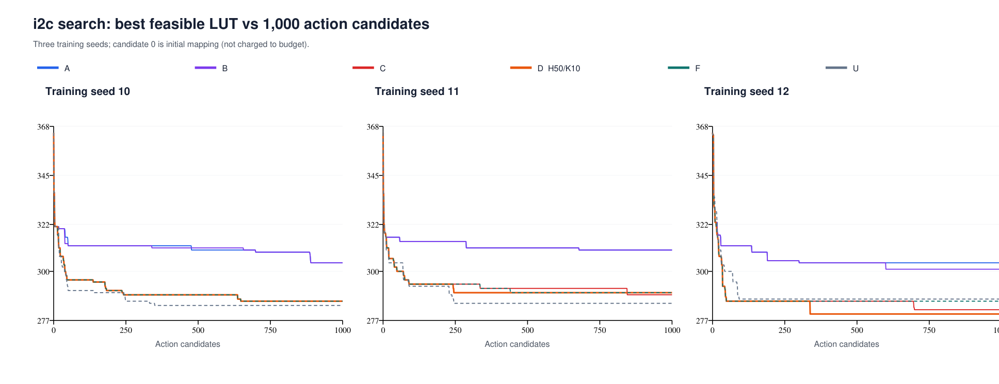
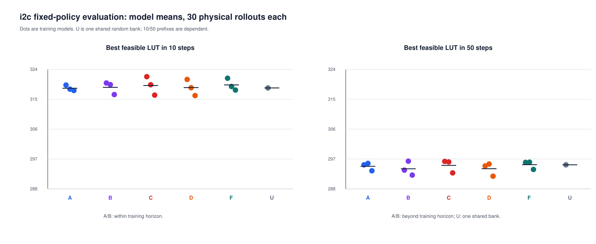

## Material Passport

- Origin Skill: academic-research-suite / experiment-agent
- Origin Mode: run + validate
- Origin Date: 2026-09-28
- Verification Status: VERIFIED
- Version Label: segmented_updates_result_v1

# i2c 长轨迹分段更新实验报告

本轮验证50步连续轨迹、每10步更新是否改善训练搜索的最佳可行LUT。所有预定组别与种子均在下表保留；主指标仅来自各训练搜索的1,000个动作候选，评估网表不会加入训练成绩。

分支 `codex/segmented-updates`，基点 `adf7bef53cdf6c4161586c03e6e2caecffe26bc4`，实现提交 `b6537d0ff08f2f138a5aa93d606a1ebdc73768b3`。
实验指纹 `e4e5bd1829d5fed4d8a7c7ca4a41b11192b313ec38af9c64023539162157ce85`；完整性状态 `complete_verified`，证据核验 `pass`。

## 训练搜索结果

|组别|种子|状态|候选|更新|最佳可行LUT|层数|首次≤300候选|耗时秒|
|---|---:|---|---:|---:|---:|---:|---:|---:|
| A | 10 | complete | 1000 | 100 | 304 | 4 | — | 181.678 |
| A | 11 | complete | 1000 | 100 | 310 | 4 | — | 182.722 |
| A | 12 | complete | 1000 | 100 | 304 | 4 | — | 183.908 |
| B | 10 | complete | 1000 | 100 | 304 | 4 | — | 214.960 |
| B | 11 | complete | 1000 | 100 | 310 | 4 | — | 216.249 |
| B | 12 | complete | 1000 | 100 | 301 | 4 | — | 219.037 |
| C | 10 | complete | 1000 | 20 | 286 | 4 | 39 | 300.997 |
| C | 11 | complete | 1000 | 20 | 289 | 4 | 48 | 322.360 |
| C | 12 | complete | 1000 | 20 | 282 | 4 | 35 | 321.405 |
| D | 10 | complete | 1000 | 100 | 286 | 4 | 39 | 319.083 |
| D | 11 | complete | 1000 | 100 | 290 | 4 | 48 | 347.687 |
| D | 12 | complete | 1000 | 100 | 280 | 4 | 35 | 349.578 |
| F | 10 | complete | 1000 | 0 | 286 | 4 | 39 | 351.122 |
| F | 11 | complete | 1000 | 0 | 290 | 4 | 48 | 376.069 |
| F | 12 | complete | 1000 | 0 | 286 | 4 | 35 | 376.141 |
| U | 10 | complete | 1000 | 0 | 284 | 4 | 38 | 309.707 |
| U | 11 | complete | 1000 | 0 | 285 | 4 | 69 | 282.485 |
| U | 12 | complete | 1000 | 0 | 287 | 4 | 42 | 276.226 |

|组别|完成/预定|可行/预定|最佳可行LUT均值±标准差|300 LUT命中|
|---|---|---|---:|---:|
| A | 3/3 | 3/3 | 306.000 ± 2.828 | 0/3 |
| B | 3/3 | 3/3 | 305.000 ± 3.742 | 0/3 |
| C | 3/3 | 3/3 | 285.667 ± 2.867 | 3/3 |
| D | 3/3 | 3/3 | 285.333 ± 4.110 | 3/3 |
| F | 3/3 | 3/3 | 287.333 ± 1.886 | 3/3 |
| U | 3/3 | 3/3 | 285.333 ± 1.247 | 3/3 |

A为原版H10/K10；B为原奖励尺度H10/K10；C为H50/K50；D为目标H50/K10；F为初始化网络冻结H50，U为均匀随机H50。F/U每10步只提交检查点，没有更新。初始映射参加选优但不计动作预算；标准差使用ddof=0。缺失、不完整或不可行时不对成功子集求主均值。

## 预定比较与效果判断

正差=对照LUT−处理LUT；平均至少减少1 LUT且至少两个训练种子改善为预先固定的探索性筛查门槛。

|比较|解释|种子10差|种子11差|种子12差|平均减少LUT|胜/平/负|筛查|
|---|---|---:|---:|---:|---:|---|---|
| D−A | 工程收益 | 18 | 20 | 24 | 20.667 | 3/0/0 | 通过 |
| D−C | 分段更新收益 | 0 | -1 | 2 | 0.333 | 1/1/1 | 未通过 |
| D−F | 相对冻结网络的学习增量 | 0 | 0 | 6 | 2.000 | 1/2/0 | 未通过 |
| D−U | 相对均匀随机的学习增量 | -2 | -5 | 7 | 0.000 | 1/0/2 | 未通过 |
| B−A | 尺度处理影响 | 0 | 0 | 3 | 1.000 | 1/2/0 | 未通过 |

工程收益（D相对A）：达到预定筛查门槛；平均减少 20.667 LUT，三个种子胜/平/负为 3/0/0。

分段更新收益（D相对C）：未达到预定筛查门槛；平均减少 0.333 LUT，三个种子胜/平/负为 1/1/1。

相对冻结网络的增量（D相对F）：未达到预定筛查门槛；平均减少 2.000 LUT，三个种子胜/平/负为 1/2/0。

相对均匀随机的增量（D相对U）：未达到预定筛查门槛；平均减少 0.000 LUT，三个种子胜/平/负为 1/0/2。

D−A同时改变轨迹长度和回报尺度；它只支持整体工程比较。D−C针对同尺度学习器的更新间隔；D−F/U检查是否超出无学习搜索。长轨迹或随机搜索的收益不能直接归功于训练。三个种子仅支持本轮探索性描述，不能宣称稳定优越或统计显著。

## 固定模型独立评估

每个最终模型使用30000–30029共30个新评估种子，各执行一条不更新的50步物理轨迹。A/B/C/D/F共15个模型库，U只使用seed-10的一份共享随机参考，共16个库、480条轨迹。每条轨迹的10步和50步前缀相关，前缀行共960条，但样本数仍为480；U的30条参考不重复计数。每模型库均值描述策略采样变化，不能把30次评估当作30次独立训练。

|组别|训练种子|前缀|可行/30|最佳可行LUT均值±标准差|不可行终点|超训练长度|
|---|---:|---:|---:|---:|---:|---|
| A | 10 | 10 | 30/30 | 319.300 ± 5.658 | 0 | 否 |
| A | 10 | 50 | 30/30 | 295.233 ± 4.773 | 0 | 是 |
| A | 11 | 10 | 30/30 | 318.067 ± 5.779 | 0 | 否 |
| A | 11 | 50 | 30/30 | 295.667 ± 6.188 | 0 | 是 |
| A | 12 | 10 | 30/30 | 317.667 ± 7.756 | 0 | 否 |
| A | 12 | 50 | 30/30 | 293.433 ± 4.364 | 0 | 是 |
| B | 10 | 10 | 30/30 | 319.933 ± 6.557 | 0 | 否 |
| B | 10 | 50 | 30/30 | 293.633 ± 4.694 | 0 | 是 |
| B | 11 | 10 | 30/30 | 319.433 ± 5.625 | 0 | 否 |
| B | 11 | 50 | 30/30 | 296.333 ± 5.600 | 0 | 是 |
| B | 12 | 10 | 30/30 | 316.433 ± 8.077 | 0 | 否 |
| B | 12 | 50 | 30/30 | 292.133 ± 4.849 | 0 | 是 |
| C | 10 | 10 | 30/30 | 321.833 ± 7.137 | 0 | 否 |
| C | 10 | 50 | 30/30 | 296.267 ± 4.335 | 0 | 否 |
| C | 11 | 10 | 30/30 | 319.400 ± 5.529 | 0 | 否 |
| C | 11 | 50 | 30/30 | 296.100 ± 5.816 | 0 | 否 |
| C | 12 | 10 | 30/30 | 316.267 ± 8.370 | 0 | 否 |
| C | 12 | 50 | 30/30 | 292.800 ± 4.571 | 0 | 否 |
| D | 10 | 10 | 30/30 | 321.000 ± 7.033 | 0 | 否 |
| D | 10 | 50 | 30/30 | 294.900 ± 4.650 | 0 | 否 |
| D | 11 | 10 | 30/30 | 318.500 ± 5.620 | 0 | 否 |
| D | 11 | 50 | 30/30 | 295.467 ± 4.808 | 0 | 否 |
| D | 12 | 10 | 30/30 | 316.133 ± 8.184 | 0 | 否 |
| D | 12 | 50 | 30/30 | 291.800 ± 4.743 | 0 | 否 |
| F | 10 | 10 | 30/30 | 321.367 ± 6.974 | 0 | 否 |
| F | 10 | 50 | 30/30 | 295.967 ± 4.722 | 0 | 否 |
| F | 11 | 10 | 30/30 | 318.867 ± 5.220 | 0 | 否 |
| F | 11 | 50 | 30/30 | 296.033 ± 5.624 | 0 | 否 |
| F | 12 | 10 | 30/30 | 317.800 ± 8.167 | 0 | 否 |
| F | 12 | 50 | 30/30 | 293.833 ± 5.404 | 0 | 否 |
| U | 10 | 10 | 30/30 | 318.433 ± 6.136 | 0 | 否 |
| U | 10 | 50 | 30/30 | 295.233 ± 5.333 | 0 | 否 |

A/B的50步评估明确为超出训练长度的测试；其10步前缀为训练长度内的参考。C/D/F/U的10步与50步前缀用于同条轨迹的预算比较。所有评估最佳值与终点值另见evaluation.csv。

|前缀|比较|三个模型均值差的均值LUT|胜/平/负|共享U|
|---:|---|---:|---|---|
| 10 | D−A | -0.200 | 1/0/2 | 否 |
| 10 | D−C | 0.622 | 3/0/0 | 否 |
| 10 | D−F | 0.800 | 3/0/0 | 否 |
| 10 | D−U | -0.111 | 1/0/2 | 是 |
| 10 | B−A | -0.256 | 1/0/2 | 否 |
| 50 | D−A | 0.722 | 3/0/0 | 否 |
| 50 | D−C | 1.000 | 3/0/0 | 否 |
| 50 | D−F | 1.222 | 3/0/0 | 否 |
| 50 | D−U | 1.178 | 2/0/1 | 是 |
| 50 | B−A | 0.744 | 2/0/1 | 否 |

评估差额为逐训练模型的30轨迹均值之差；与共享U的三项差额共用相同参考，不能用来估计三份独立U样本的变异。

## 成本、失败与核验

- 训练动作候选：18000/18,000；评估动作候选：24000/24,000。
- 额外初始映射：训练840次、评估480次；另有resyn2基线和最终网表核验调用。
- 训练段计时合计5131.414秒；所有监督进程计时合计12148.946秒（并行进程耗时求和，非总墙钟时间）。
- 失败进程0，硬超时0，不完整训练0，缺失评估轨迹0。
- 不可行训练候选0；评估50步不可行终点0。
- 恢复时回滚的已记录动作行0；未写日志前的额外ABC调用不能精确追计，相关耗时留在原始进程尝试记录中。
- 最多3个任务并行、每进程1个Torch线程、每任务30分钟硬超时；停止点为预定三种子，不增加种子或调参追加实验。
- 独立核验逐步重算CSV奖励及最好值、Welford归一化、动作概率/采样RNG、段尾目标与网络/Adam更新哈希；核验全部交付最佳网表的映射指标和CEC。
- 验证器修订见validation-amendment.json：未映射网表重新做LUT6映射时覆盖可能变化，分别报告其实测LUT/层数及CEC；已映射网表仍须与训练或评估得分精确一致。该修订未改变学习器或已完成轨迹。
- 原始中间状态来自Yosys特征日志；没有再次运行全部42,000动作来重提取每个原始状态。真实工具连续/中断恢复精确回归由测试记录支持。

## 统计风险核查（11/11）

|风险|等级|本轮核查|
|---|---|---|
| 辛普森悖论 | CAUTION | 展示三种子逐项差和均值；训练搜索与固定模型评估分别统计，不合并两类结果。 |
| 生态谬误 | CAUTION | 推断单位为三次训练种子；同一模型的30次评估和10/50前缀不升级为独立训练样本。 |
| 伯克森悖论 | NOTE | 种子和预算先固定，保留所有失败、不可行和未命中；仅i2c一个电路限制外推。 |
| 碰撞变量偏差 | NOTE | 不按训练收益、命中300或训练时长筛选模型，也不据这些后验量调整比较。 |
| 忽视基准率 | NOTE | 不是诊断分类任务；每组同时报告可行率、失败数和300 LUT命中数。 |
| 回归均值 | CAUTION | 重新运行全部预定种子，没有选择历史极端种子；本轮结果仍需外部实验确认。 |
| 幸存者偏差 | NOTE | 任一预定训练种子或评估轨迹缺失/不可行时，不对成功子集生成该组主均值。 |
| 多重搜索效应 | CAUTION | 完整报告预定D-A/D-C/D-F/D-U/B-A比较；阈值是探索性筛查，不是显著性检验。 |
| 分析分叉路径 | NOTE | 源码、协议、工具和电路哈希在运行前锁定；不增种子，不事后调参或改阈值。 |
| 相关不等于因果 | CAUTION | D-C隔离本方案中的更新间隔，D-F/U检查学习增量；D-A同时改变轨迹长度和回报尺度，不能单归因于分段更新。 |
| 反向因果 | NOTE | 算法和预算在测量前指定；不由结果改变组别。此设计不支持跨电路机制定论。 |

## 可复现证据

protocol.yml保存预定协议；experiment.json记录源码、工具、电路与环境哈希；verification.json记录独立回放和逐网表核验。完整初始/最终权重、动作日志、CSV、检查点、最佳网表及监督记录保存在results/segmented-updates。SHA-256清单、模型清单与本地证据压缩包由package入口生成，复现命令见README.md。

