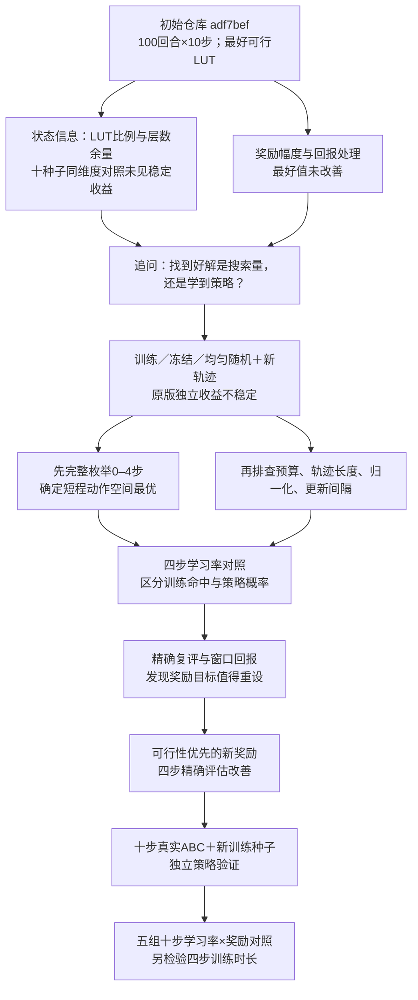

# DRiLLS 改进实验全流程报告

> **范围**：从初始 FPGA 仓库提交 [`adf7bef`](https://github.com/Shun-Zhan/drills/commit/adf7bef53cdf6c4161586c03e6e2caecffe26bc4) 到 2026-09-29 的 [`b9de818`](https://github.com/Shun-Zhan/drills/commit/b9de818397359b6f3f765ce398744c43b8701696)，包括从初始提交分叉的 `new-state` 和 `change-rewards` 实验。
>
> **核验状态：ANALYZED**。本报告根据已有协议、报告和结果表整理，并复算主要汇总值；没有重新训练模型，也没有重新执行全部 ABC 映射或等价性检查。逐种子数据和原核验记录见文末来源索引。

## 1. 一页结论：问题是怎样逐步改变的

一开始的问题是“增加性能状态、调整奖励，能否让 DRiLLS 找到更少 LUT 的可行电路？”两项早期尝试都能正常运行，却没有得到可靠的工程收益。发现十一维性能状态的十种子训练搜索收益不稳定后，研究返回原始九维设置，补做训练、冻结网络和均匀随机对照。这些对照揭示了更关键的区别：**训练期间反复搜索得到好网表，不等于训练结束后的策略在新轨迹上也更好**。原版 100 回合×10 步下，网络权重和动作分布确实改变，但三个电路没有一致的独立策略收益。这应表述为“原默认设置下缺少稳定收益证据”，而不是“强化学习无效”。[十一维状态记录](https://github.com/Shun-Zhan/drills/blob/eae0c7c273ea6ec240833948ddc9dcef92a022c6/state-performance-experiment-summary.md) · [原九维学习有效性报告](experiments/learning-effectiveness/report.md)

后续实验把搜索预算、轨迹长度、状态归一化、更新间隔和学习率逐项拆开。在长轨迹设置下，i2c 的**搜索**结果大幅改善，但冻结和均匀随机组也能取得接近结果；仅提高学习率又会使 max 的四步可行概率下降。四步动作空间可以完整枚举，因而能够把“偶然搜到最优”与“冻结策略把概率分配给好序列”分开，并检查奖励是否真正偏好目标解。[分段更新报告](experiments/segmented-updates/report.md) · [四步精确枚举](experiments/ten-step-optimality/report.md) · [学习率报告](experiments/four-step-lr/report.md)

最终，面向可行性和最好 LUT 的新奖励在四步精确评估中明显改善 i2c 与 max；十步真实 ABC、全新训练种子及独立评估也支持这两个电路的收益。最后的三种子、五组十步对照显示“窗口回报＋0.01 学习率＋新奖励”相对原版：i2c 平均少 **12.911 LUT**，max 可行率高 **0.244**（即 24.4 个百分点），int2float 平均反而多 **0.067 LUT**。另一个四步实验将同一新奖励配置从 250 延长到 1000 回合，三个电路的十个配对种子均观察到改善；它检验训练时长，不能与十步同预算对照混为一项收益。[四步奖励报告](experiments/four-step-reward/report.md) · [十步新种子验证](experiments/ten-step-reward-validation/report.md) · [最终两步报告](experiments/lr-reward-two-stage/report.md)

## 2. 起点：初始仓库究竟在优化什么

初始实现针对三个 AIG 电路做 FPGA LUT6 映射：`int2float`、`i2c`、`max` 的映射层数上限分别是 3、4、41。在满足层数约束的候选中，优先减少 LUT；不可行候选不能与可行候选直接按 LUT 比较。原设置每个电路使用种子 0、1、2，各训练 100 回合，每回合先执行 `strash`，再由 Actor 依状态选择 10 次 ABC 优化动作。每步重新映射以得到 LUT/层数；Critic 估计状态价值，回合结束后将折扣回报逐回合标准化，并用 A2C 更新 Actor/Critic。初始映射也可成为本次搜索的最好候选。[初始参数](https://github.com/Shun-Zhan/drills/blob/adf7bef53cdf6c4161586c03e6e2caecffe26bc4/params.yml) · [初始训练实现](https://github.com/Shun-Zhan/drills/blob/adf7bef53cdf6c4161586c03e6e2caecffe26bc4/drills/model.py) · [环境与候选排序](https://github.com/Shun-Zhan/drills/blob/adf7bef53cdf6c4161586c03e6e2caecffe26bc4/drills/fpga_session.py)

原版状态有九项结构特征，奖励主要根据相邻两步 LUT 的增减和当前映射是否满足层数约束给离散分值；默认 Adam 学习率为 0.001。下表是**训练期间每个种子累计找到的最好可行解**，并非训练后策略的独立测试成绩。[初始 README](https://github.com/Shun-Zhan/drills/blob/adf7bef53cdf6c4161586c03e6e2caecffe26bc4/README.md)

| 电路 | 层数上限 | 固定 `resyn2` 参考：LUT | 原版 100×10：最好可行 LUT，三种子均值 |
|---|---:|---:|---:|
| int2float | 3 | 48 | 44.000 |
| i2c | 4 | 322 | 303.667 |
| max | 41 | 777 | 772.333 |

此后报告使用三种口径，不能互相替代：

1. **训练搜索最好值**：在给定训练动作预算内遇到的最好可行网表，受重复抽样次数影响。比较 LUT 时，本报告统一以“对照 LUT − 处理 LUT”为正向改善。
2. **冻结策略独立评估**：固定训练后的网络，在未参与训练的新轨迹上采样；既要和初始网络比较，也要和均匀随机策略比较。`max` 有大量不可行轨迹，主指标应先看**可行率**，不能删除失败轨迹后只比较 LUT 均值。
3. **四步精确评估**：对固定起点和七个动作的全部 `7⁴ = 2,401` 条完整四步序列计算策略概率。i2c、int2float 用“单次轨迹预期最好 LUT 与四步最优 LUT 的差距”（越低越好），max 用“单次轨迹可行概率”（越高越好）。它消除了轨迹抽样误差，但仍受训练种子数量及固定电路范围限制。[四步复评报告](experiments/four-step-followup/report.md)

## 3. 从初试到改进：研究决策图与阶段总表

下图的箭头表示**上一轮观察引出了下一轮要检验的问题**，不是说某一代码分支自动合并到另一分支，也不表示跨实验数值可直接比较。

| 阶段与核心假设 | 对照、预算与主要指标 | 观察和下一步决定 | 状态与依据 |
|---|---|---|---|
| **状态信息**：让策略看到当前 LUT 比例及层数余量 | 九维原版与十一维初查；再以十一维零特征作同维度对照。三电路、种子 0–9、每种子 100×10；训练最好 LUT | 三种子初查似有小幅改善；十种子同维度对照仅 i2c 少 0.2、max 少 0.1、int2float 多 0.1 LUT，未确认信息收益。转向奖励与学习链路。[报告](https://github.com/Shun-Zhan/drills/blob/eae0c7c273ea6ec240833948ddc9dcef92a022c6/state-performance-experiment-summary.md) | 完成；原九维没有十种子对照，零特征十一维不等于原九维 |
| **奖励幅度**：按可行时的 LUT 相对变化给奖励 | 原奖励与新幅度奖励；三电路、种子 0–2、100×10；训练最好 LUT | 三电路逐种子最好值全部持平。继续查回报标准化是否掩盖奖励变化。[报告](https://github.com/Shun-Zhan/drills/blob/70d9df453bf0cd5c0b9689a2d22be2a03a8d32eb/experiments/change-rewards/report.md) | 完成；仅三种子、训练搜索指标 |
| **回报与搜索长度**：改变标准化或延长轨迹能否带来学习增量 | i2c，种子 0–2；幅度奖励下做 100×10 标准化/不标准化/放大系数/冻结对照；原始离散奖励下做 100×10/100×30 训练与冻结对照；训练最好 LUT | 取消标准化没有改善；奖励尺度从 1 到 10 的最好值相同。30 步训练虽比 10 步少 14.333 LUT，30 步冻结比 10 步少 17.000 LUT；转而严格区分搜索与学习。[回报](https://github.com/Shun-Zhan/drills/blob/70d9df453bf0cd5c0b9689a2d22be2a03a8d32eb/experiments/i2c-return-handling/report.md) · [长度](https://github.com/Shun-Zhan/drills/blob/70d9df453bf0cd5c0b9689a2d22be2a03a8d32eb/experiments/i2c-learning-horizon/report.md) | 完成；跨长度同时改变动作预算 |
| **学习有效性**：原版网络更新是否转化为新轨迹收益 | 三电路，种子 0–2，100×10；训练/初始冻结/均匀随机；每模型 30 条新十步轨迹 | 权重与策略分布确有改变，三个电路却无一致的独立收益；转向预算和机制排查。[报告](experiments/learning-effectiveness/report.md) | 完成；仅三次独立训练 |
| **四步精确枚举**：先弄清短程动作空间的最好值 | 固定起点与七动作，完整覆盖三个电路的 0–4 步序列；指标为最好可行 LUT 与可行序列数 | 得到四步最优 44/312/781；为后续短程学习率、奖励和冻结策略概率提供精确参照。[报告](experiments/ten-step-optimality/report.md) | 完成；十步及全局最优仍未知 |
| **预算与状态处理**：长轨迹、更多更新或固定尺度输入是否解决问题 | 50×50、200×5；i2c 固定尺度归一化；i2c 连续 50 步每 10 步更新；训练搜索与冻结评估 | 50×50 有超时缺失；200×5 的 i2c 获得局部独立收益；固定尺度归一化未过预设门槛；分段更新单项未解释长轨迹收益。结合已完成的四步枚举，转向可精确评估的短程策略。[报告索引](#附录证据与版本索引) | 50×50 **部分完成**；其余完成但多为探索性比较 |
| **四步学习率**：更大更新幅度是否改善策略 | 以已枚举的四步空间为参照；三电路、种子 0–9、250×4；学习率 0.001/0.01/随机；训练搜索与每模型 10 次冻结采样，再做精确复评 | i2c 训练期最优命中 3/10→6/10，max 的 0.01 组可行种子 10/10→6/10；稀疏采样不足以稳定判断策略，于是精确计算四步策略表现。[枚举](experiments/ten-step-optimality/report.md) · [学习率](experiments/four-step-lr/report.md) | 完成；使用先前的四步枚举作为基准 |
| **窗口回报**：缓解长回报标准化和更新尺度问题 | i2c，种子 0–9，250×4、学习率 0.01；旧实现对新窗口回报；精确预期 LUT 差距 | 均值差距 16.873→14.418，但仅 5/10 种子改善，区间跨零，未达到扩展门槛。下一步审计奖励与真实目标的对齐。[报告](experiments/four-step-followup/report.md) | 完成；方向不确定 |
| **新奖励与十步验证**：明确鼓励首次可行及更低的最好可行 LUT | 四步：种子 0–9、250×4，精确评估；十步：先历史种子 0–4 搜索，再用新种子 20–29、100×10 与旧奖励配对，30 条新轨迹/模型 | 四步 i2c、max 均 10/10 种子改善；历史十步搜索 i2c 5/5、max 4/5，故改用独立评估；新种子十步两电路均 10/10 改善。最后拆分学习率、奖励和训练时长。[四步](experiments/four-step-reward/report.md) · [十步](experiments/ten-step-reward-validation/report.md) | 完成；四步查表、十步真实 ABC |
| **最终组合**：新奖励与学习率是否交互，训练更久是否有用 | 十步：三电路、种子 0–2、100×10，原版加窗口回报的 2×2 学习率/奖励；另以三电路、种子 0–9、四步精确评估比较 250/1000 回合 | 十步组合改善 i2c 和 max，不改善 int2float；四步延长训练在三电路十个配对种子均改善。分别陈述两个问题，不合并成单一提升率。[报告](experiments/lr-reward-two-stage/report.md) | 完成；十步因素对照仅三种子 |

## 4. 为什么早期“改了方法”还不足以说明学到了

**状态初试的混杂因素**：最早将映射后 LUT 比例和层数余量加入状态，输入从九维变成十一维，网络输入层和初始化也随之改变。三种子均值下降只是线索。后来十一维零特征对照把输入维度及初始权重控制一致，扩展到十个种子后，i2c、max 的平均减少量仅 0.2、0.1 LUT，int2float 反向 0.1 LUT，配对区间均含零。这个实验没有分别消融两项新特征，也没有独立策略评估。[状态完整记录](https://github.com/Shun-Zhan/drills/blob/eae0c7c273ea6ec240833948ddc9dcef92a022c6/state-performance-experiment-summary.md) · [十种子数据](https://github.com/Shun-Zhan/drills/blob/eae0c7c273ea6ec240833948ddc9dcef92a022c6/state-validation-ten.csv)

**补做对照的先后关系**：十一维状态分支在 9 月 26 日完成十种子结果，当时归档的两组都是正常更新网络的训练组。随后返回从初始提交分出的实验：先在奖励与回报处理中为 i2c 补做冻结初始网络对照，再在原始九维、原始奖励的 100×10 设置下，为三个电路系统补做训练／冻结／均匀随机三组和新轨迹评估。后两项的配置均只有原九维特征，不能当作十一维冻结结果。已归档的十一维报告明确没有冻结模型独立测试；当前仓库也未找到可核验的十一维冻结或均匀随机运行记录。下表展示各自训练搜索期间的最好可行 LUT 均值；十一维列用种子 0–9，九维列用种子 0–2，不能跨设置当作配对收益。[十一维十种子结果](https://github.com/Shun-Zhan/drills/blob/eae0c7c273ea6ec240833948ddc9dcef92a022c6/state-validation-ten.md) · [i2c 回报与冻结](https://github.com/Shun-Zhan/drills/blob/70d9df453bf0cd5c0b9689a2d22be2a03a8d32eb/experiments/i2c-return-handling/report.md) · [原九维三组结果](experiments/learning-effectiveness/report.md)

| 电路 | 十一维零特征：训练 | 十一维性能特征：训练 | 十一维冻结／均匀随机 | 后补原九维：训练／冻结／均匀随机 |
|---|---:|---:|---|---|
| int2float | 43.700 | 43.800 | 未找到可核验结果 | 44.000／43.667／44.000 |
| i2c | 304.300 | 304.100 | 未找到可核验结果 | 303.667／304.667／304.333 |
| max | 771.800 | 771.700 | 未找到可核验结果 | 772.333／770.333／774.667 |

这里的“冻结”仍根据初始网络输出的状态相关概率抽动作；“均匀随机”才是七个动作各以 `1/7` 概率抽取。原九维实验另外做了冻结模型的新轨迹独立评估；当前十一维归档没有对应结果。“未找到可核验结果”只说明现有仓库的证据范围，不能据此断言其他位置从未运行。[原九维协议与评估](experiments/learning-effectiveness/report.md)

**奖励幅度与训练搜索的局限**：第一版新奖励只把“前后都可行时 LUT 变化的方向”改为“相对于初始 LUT 的变化幅度”，三电路、三个种子的最终最好 LUT 完全一样。在这个幅度奖励下，对 i2c 取消逐回合回报标准化后，最好值均值从 303.667 变为 304.333；把幅度系数从 1 放大到 10，最好值仍为 304.333。冻结初始网络虽比训练略差，但差值只有约 1 LUT。它提示要检查更新是否改善策略，而不是只看有没有执行优化器。[奖励幅度报告](https://github.com/Shun-Zhan/drills/blob/70d9df453bf0cd5c0b9689a2d22be2a03a8d32eb/experiments/change-rewards/report.md) · [回报对照报告](https://github.com/Shun-Zhan/drills/blob/70d9df453bf0cd5c0b9689a2d22be2a03a8d32eb/experiments/i2c-return-handling/report.md)

**长轨迹找到低 LUT 的原因并不单一**：此轮恢复原始离散奖励，i2c 从 100×10 改到 100×30，训练最好值均值 303.667→289.333；冻结组也从 304.667→287.667，甚至在 30 步同预算下优于训练组。这次同时增加动作候选并扩大序列空间，还改变单次回报长度及损失求和长度；因此“网表变好”不能归因于 Actor 学得更好。[10/30 步报告](https://github.com/Shun-Zhan/drills/blob/70d9df453bf0cd5c0b9689a2d22be2a03a8d32eb/experiments/i2c-learning-horizon/report.md)

**系统的学习有效性对照**：原 100×10 条件下，训练组 9/9 次 Actor/Critic 权重和固定探针动作分布都改变。可是冻结策略的 30 条新十步评估中，第 100 回合相对初始网络：int2float 平均少 0.100 LUT、i2c 少 0.911 LUT，两者探索性区间都覆盖零；max 的可行轨迹是 32/90 对 32/90。与均匀随机比较也没有三个电路一致的优势。由此可以说**发生了参数更新和策略变化，但没有观察到稳定、跨电路的独立策略收益**。[学习有效性报告](experiments/learning-effectiveness/report.md) · [比较数据](experiments/learning-effectiveness/comparisons.csv)

## 5. 如何定位瓶颈，而不把不同实验混成一条曲线

在原版学习有效性对照之后，为了获得可解释的短程基准，先**完整枚举了固定起点、七动作下的 0–4 步序列**，得到四步范围内的最优可行 LUT：int2float 44、i2c 312、max 781。其中 max 的 2,401 条完整四步序列仅 26 条可行。这些数值不是十步最优，更不是 FPGA 映射的全局最优；已有十步搜索最好值 43、300、763 只能说明更长序列可以越过四步界限。[枚举报告](experiments/ten-step-optimality/report.md) · [候选与核验](experiments/ten-step-optimality/summary.json)

50×50 实验同时把总动作数从 1,000 增至 2,500、单条轨迹从 10 步增至 50 步、更新次数从 100 次降至 50 次。训练只完成 19/27 次，独立评估实际完成 810/900 条；`max` 缺少第 50 回合的完整模型，不能用中间快照补齐主结果。i2c 已完成部分的独立比较只对初始网络显示探索性收益，未对均匀随机得到同样支持。200×5 则保持 1,000 个动作候选、增加更新次数并缩短轨迹；i2c 的第 200 回合模型相对初始/均匀策略分别少 3.167/3.244 LUT，三个训练种子方向一致，但 int2float 和 max 未达到同样的双基线结论。相同动作数也不等于相同序列空间或更新规则。[50×50 报告](experiments/learning-effectiveness-50x50/report.md) · [200×5 报告](experiments/learning-effectiveness-200x5/report.md)

随后两项针对“输入表示”和“更新频率”的排查没有支持简单解释。仅改 i2c 状态归一化为固定尺度，训练最好 LUT 从原方法的 303.667 变为 305.333（更差 1.667），相对冻结的学习增量也没有改善。另一次 i2c 对照把连续轨迹扩至 50 步、每 10 步更新：相对原 10 步配置的训练搜索平均少 20.667 LUT；但和同为 50 步、每 50 步更新组比，只少 0.333 LUT，和同预算均匀随机组比平均持平。整体工程结果主要回答“更长轨迹和改变条件后搜到了什么”，没有单独证实分段更新或学习带来了这 20.667 LUT。[归一化报告](experiments/fixed-state-normalization/report.md) · [分段更新报告](experiments/segmented-updates/report.md)

四步学习率对照说明为什么需要精确评估：0.01 相对 0.001 使 Actor/Critic 权重方差上升、策略熵下降，i2c 训练期命中四步最优的种子从 3/10 增至 6/10；但 max 的 0.01 组训练期仅 6/10 种子找到可行解，且每模型十次冻结采样极难辨别小概率事件。后来对旧 0.01 策略精确求值，i2c 的单次预期最优差距为 16.873，初始网络为 20.496；max 的单次可行概率却只有 0.000124，低于初始网络的 0.012845。进一步采用滑动窗口回报后，i2c 平均差距降到 14.418，但只有 5/10 种子优于旧 0.01，探索性区间跨零。这使研究重点转到**奖励是否把概率推向真正可行且 LUT 更少的序列**。[学习率报告](experiments/four-step-lr/report.md) · [精确复评和窗口报告](experiments/four-step-followup/report.md)

## 6. 奖励改进、十步确认与最终组合

原离散奖励主要看**相邻一步**的 LUT 增减及可行性，可能让多个最终质量不同的四步序列获得同样高回报。四步奖励审计中，i2c 的原奖励并列最高序列有 500 条，其中仅 4 条达到四步最优；max 的原奖励最高序列未达到四步最优。新奖励改为：首次达到可行约束时给明确奖励；可行后只对刷新“本回合最好可行 LUT”给予与改善幅度相关的奖励；尚不可行时奖励缩小层数缺口。新奖励在四步空间的最高分序列，i2c 为 2/2 最优、max 为 7/7 最优。这个审计说明了设计动机，实际效果仍由后续训练对照检验。[奖励实现](experiments/four-step-reward/reward.py) · [四步奖励报告](experiments/four-step-reward/report.md)

### 6.1 四步精确评估：比较的是策略概率，不是训练期最好网表

四步实验固定窗口回报、学习率 0.01、250 回合×4 步，十个训练种子；每个冻结模型按所有 2,401 条四步动作序列的策略概率精确求期望。数值由[逐种子配对表](experiments/four-step-reward/paired.csv)复算，正向改善的定义随主指标方向而定。

| 电路与主指标 | 窗口旧奖励 | 窗口新奖励 | 平均配对改善 | 改善种子 |
|---|---:|---:|---:|---:|
| i2c：预期最优 LUT 差距，越低越好 | 14.418 | 4.162 | 少 10.256 LUT | 10/10 |
| max：单次可行概率，越高越好 | 0.000058 | 0.445250 | 高 0.445192 | 10/10 |
| int2float：预期最优 LUT 差距，越低越好 | 3.658 | 2.814 | 少 0.844 LUT | 8/10 |

四步查表结果尤其清楚地显示：max 即使训练期间偶然找到可行网表，也要检查最终策略对可行序列分配了多少概率。四步精确评估仍只覆盖这三个电路和固定四步空间；int2float 是本轮次要观察。[协议](experiments/four-step-reward/protocol.yml) · [汇总](experiments/four-step-reward/summary.json)

### 6.2 十步真实 ABC：先暴露旧门槛，再用新种子检验冻结策略

条件性十步实验最初检查种子 0–4 的训练期间最好 LUT 是否**逐种子同时胜过冻结与均匀随机**。i2c 是 5/5，max 是 4/5；max 的种子 0 新奖励找到 764 LUT，冻结组却找到 763 LUT，因此旧 5/5 门槛未通过。这个门槛属于训练搜索结果，不能当作冻结策略能力的确认。[历史十步结果](experiments/four-step-reward/report.md) · [门槛说明](experiments/ten-step-reward-validation/report.md)

随后预先固定全新训练种子 20–29，旧奖励与新奖励仅在奖励函数上不同：均使用窗口回报、学习率 0.01、100 回合×10 步，并在每个最终冻结模型上执行 30 条新十步轨迹。以十个训练种子为独立单位，新奖励在 i2c 的每种子平均最好可行 LUT 上**少 4.277**，在 max 的每种子可行率上**高 0.530**；两电路均为 10/10 种子改善。预设的单侧符号检验经两项 Holm 校正后，两项 `p=0.001953`。这支持本设置下新奖励比旧奖励更好，不证明其在未见电路或任意超参数下普遍有效。[十步验证报告](experiments/ten-step-reward-validation/report.md) · [逐种子 CSV](experiments/ten-step-reward-validation/paired-seeds.csv) · [固定协议](experiments/ten-step-reward-validation/protocol.yml)

### 6.3 最后两步：拆开学习率、奖励和训练轮数

**第一步**在同样 100×10 预算下，比较原始实现及窗口回报内的“学习率 0.001/0.01 × 旧/新奖励”四格。每组使用训练种子 0–2；每个冻结模型做 30 条新十步轨迹。下表是三种子主指标均值；前两电路为平均最好可行 LUT（越低越好），`max` 为可行轨迹比例（越高越好）。[五组逐种子数据](experiments/lr-reward-two-stage/ten-step-seeds.csv) · [固定协议](experiments/lr-reward-two-stage/protocol.yml)

| 电路 | 原始实现 | 窗口／0.001／旧奖励 | 窗口／0.001／新奖励 | 窗口／0.01／旧奖励 | 窗口／0.01／新奖励 |
|---|---:|---:|---:|---:|---:|
| int2float：LUT | 46.644 | 46.633 | 46.522 | 46.944 | 46.711 |
| i2c：LUT | 319.689 | 318.533 | 316.256 | 312.856 | **306.778** |
| max：可行率 | 0.200 | 0.178 | 0.267 | 0.078 | **0.444** |

最后一列相对原始实现，i2c 平均少 12.911 LUT、max 可行率高 0.244；int2float 平均多 0.067 LUT，不能写作三电路都改善。旧奖励下把学习率升到 0.01，max 可行率反而从 0.178 降至 0.078；新奖励下则由 0.267 升至 0.444。这是本批三种子的**交互线索**，不是对学习率单独作用的跨电路定论。[最终两步报告](experiments/lr-reward-two-stage/report.md) · [配对对照](experiments/lr-reward-two-stage/ten-step-contrasts.csv)

**第二步**固定四步窗口回报、学习率 0.01、新奖励和种子 0–9，只把训练从 250 回合延至 1000 回合，并对最终策略做四步精确评估：

| 电路与主指标 | 250 回合 | 1000 回合 | 配对平均改善 | 改善种子 |
|---|---:|---:|---:|---:|
| int2float：预期最优 LUT 差距 | 2.8136 | 2.0684 | 少 0.7452 LUT | 10/10 |
| i2c：预期最优 LUT 差距 | 4.1624 | 1.0149 | 少 3.1475 LUT | 10/10 |
| max：单次可行概率 | 0.4452 | 0.9534 | 高 0.5081 | 10/10 |

这一步支持“在该四步方案下继续训练仍有收益”。1000×4 比 250×4 使用更多训练动作；它不是原版 100×10 的等预算复现，也不能把数值接到上面的十步表形成一条统一进步曲线。[四步逐种子和快照](experiments/lr-reward-two-stage/four-step-seeds.csv) · [最终两步报告](experiments/lr-reward-two-stage/report.md)

## 7. 最终判断与答辩时应守住的边界

- **i2c**：原 100×10 的独立学习收益弱且不稳定；200×5 曾在三种子中观察到局部收益。更有力的改进证据来自奖励与学习率条件明确的四步精确评估、十步新种子独立验证以及最终五组对照。不能把 50 步训练搜索得到的低 LUT 全部归功于学习。[200×5](experiments/learning-effectiveness-200x5/report.md) · [十步验证](experiments/ten-step-reward-validation/report.md)
- **max**：它的初始映射不满足 41 层约束，短轨迹可行序列稀少。可行率比“只看成功轨迹的 LUT 均值”更能回答策略是否学会跨过约束。仅升高学习率会恶化四步概率；新奖励和最终组合在已测设置下明显提高可行率。十步历史 5/5 搜索门槛曾未通过，这一失败应与后来的新种子冻结策略结果同时报告。[四步学习率](experiments/four-step-lr/report.md) · [十步新种子](experiments/ten-step-reward-validation/report.md)
- **int2float**：四步新奖励与更长训练的精确评估有改善，但最终三种子十步组合相对原版没有改善。不能把 i2c、max 的收益外推给它。[四步奖励](experiments/four-step-reward/report.md) · [最终对照](experiments/lr-reward-two-stage/report.md)
- **证据边界**：实验只覆盖三个既定电路，许多早期比较只有三个独立训练种子；50×50 不完整。四步最优是固定动作空间内的精确值，十步最优未证明；不同预算、种子组、回报处理和主指标的数值不组成共同的提升率。原始模型和部分全量日志在 Git 忽略的本地 `results/`，仓库保存报告、紧凑数据与哈希清单；仅凭本报告不能声称独立重现全部训练。[证据与限制](experiments/lr-reward-two-stage/report.md) · [四步枚举](experiments/ten-step-optimality/report.md)

**汇报时可用的一句话**：最初改状态和奖励幅度时，训练搜索成绩没有可靠改善；冻结与随机对照说明原默认设置的学习收益不稳定；随后用可穷举的四步环境分辨策略质量，发现奖励与目标不对齐，在新奖励、合适学习率和足够训练轮数下，i2c 与 max 才出现可重复的条件性改善。

## 附录：证据与版本索引

本报告的时间线按 Git 提交与实验记录排列；`new-state`、`change-rewards` 从初始提交独立分叉，**没有**进入当前报告所在分支。其链接固定到提交哈希；当前分支内的报告与数据使用相对路径。对早期旁支可用 `git show <提交>:<路径>` 在本地离线读取。

本机的十一维原始输出仍在 Git 忽略的 `results/new-state/` 与 `results/state-validation/`：前者有初次三电路×三种子的结果及检查点，后者有十一维零特征、性能特征各三电路×十种子的结果及检查点（部分结果为历史复用）。Git 忽略 `results/`，所以这些文件不会随分支显示在提交列表中；当前分支根目录也不直接列出 `new-state` 旁支的报告文件。原九维三组对照的本机原始输出在 `results/learning-effectiveness/`，其可提交报告位于下表所列目录。这些位置分别回答“原始数据还在吗”和“当前分支能看到哪份报告”。

| 版本或实验族 | 主要原报告 | 可核对数据／协议 |
|---|---|---|
| 初始仓库 `adf7bef…bc4` | [README](https://github.com/Shun-Zhan/drills/blob/adf7bef53cdf6c4161586c03e6e2caecffe26bc4/README.md) | [参数](https://github.com/Shun-Zhan/drills/blob/adf7bef53cdf6c4161586c03e6e2caecffe26bc4/params.yml) |
| 状态旁支 `eae0c7c` | [状态实验汇总](https://github.com/Shun-Zhan/drills/blob/eae0c7c273ea6ec240833948ddc9dcef92a022c6/state-performance-experiment-summary.md) | [十种子 CSV](https://github.com/Shun-Zhan/drills/blob/eae0c7c273ea6ec240833948ddc9dcef92a022c6/state-validation-ten.csv) · [JSON](https://github.com/Shun-Zhan/drills/blob/eae0c7c273ea6ec240833948ddc9dcef92a022c6/state-validation-ten.json) |
| 早期奖励旁支 `70d9df4` | [奖励幅度](https://github.com/Shun-Zhan/drills/blob/70d9df453bf0cd5c0b9689a2d22be2a03a8d32eb/experiments/change-rewards/report.md) · [回报处理](https://github.com/Shun-Zhan/drills/blob/70d9df453bf0cd5c0b9689a2d22be2a03a8d32eb/experiments/i2c-return-handling/report.md) · [10/30 步](https://github.com/Shun-Zhan/drills/blob/70d9df453bf0cd5c0b9689a2d22be2a03a8d32eb/experiments/i2c-learning-horizon/report.md) | [奖励幅度 JSON](https://github.com/Shun-Zhan/drills/blob/70d9df453bf0cd5c0b9689a2d22be2a03a8d32eb/experiments/change-rewards/comparison.json) · [回报 JSON](https://github.com/Shun-Zhan/drills/blob/70d9df453bf0cd5c0b9689a2d22be2a03a8d32eb/experiments/i2c-return-handling/comparison.json) · [长度 JSON](https://github.com/Shun-Zhan/drills/blob/70d9df453bf0cd5c0b9689a2d22be2a03a8d32eb/experiments/i2c-learning-horizon/comparison.json) |
| 学习有效性与预算 | [100×10](experiments/learning-effectiveness/report.md) · [50×50](experiments/learning-effectiveness-50x50/report.md) · [200×5](experiments/learning-effectiveness-200x5/report.md) | 各目录的 `protocol.yml`、`summary.json`、`comparisons.csv` 或 `evaluation.csv` |
| 表示、轨迹与四步基准 | [固定尺度](experiments/fixed-state-normalization/report.md) · [分段更新](experiments/segmented-updates/report.md) · [≤4 步枚举](experiments/ten-step-optimality/report.md) | [归一化汇总](experiments/fixed-state-normalization/summary.json) · [分段汇总](experiments/segmented-updates/summary.json) · [枚举汇总](experiments/ten-step-optimality/summary.json) |
| 学习率、窗口与新奖励 | [四步学习率](experiments/four-step-lr/report.md) · [精确复评](experiments/four-step-followup/report.md) · [四步奖励](experiments/four-step-reward/report.md) | [学习率汇总](experiments/four-step-lr/summary.json) · [新奖励逐种子](experiments/four-step-reward/paired.csv) |
| 十步确认与最终组合 `b9de818` | [新种子验证](experiments/ten-step-reward-validation/report.md) · [最终两步](experiments/lr-reward-two-stage/report.md) | [十步配对](experiments/ten-step-reward-validation/paired-seeds.csv) · [五组十步](experiments/lr-reward-two-stage/ten-step-seeds.csv) · [四步延长](experiments/lr-reward-two-stage/four-step-seeds.csv) |

**整理说明**：本报告使用 AI 辅助阅读代码、交叉核对既有结果和撰写文字；实验代码、训练、原始核验与统计由上述历史提交记录。本次仅对引用的主要 CSV/JSON 均值与差值做独立复算，未把这种复算称为重新运行实验。
